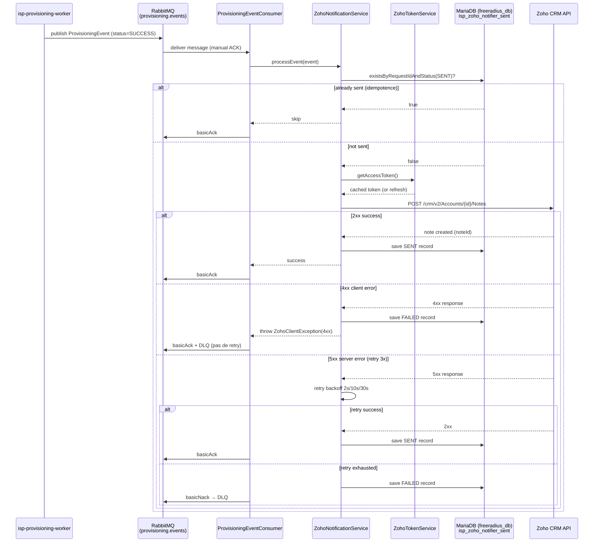

# Architecture — isp-zoho-notifier

## Séquence principale



## Composants

| Composant | Rôle |
|-----------|------|
| `ProvisioningEventConsumer` | Listener AMQP manual ACK, délègue au service |
| `ZohoNotificationService` | Logique métier : idempotence, retry, envoi Zoho |
| `ZohoTokenService` | Cache OAuth2 token (TTL = expires_in - 60s) |
| `ZohoNotificationSentRepository` | Persistance idempotence (JPA + MariaDB via ProxySQL) |
| `RetentionScheduler` | Purge des enregistrements > 90 jours |
| `WebhookController` | Optionnel — endpoint HTTP si `ZOHO_WEBHOOK_ENABLED=true` |
| `CorrelationIdFilter` | Propagation `X-Correlation-ID` dans MDC |

## Flux DLQ

```
provisioning.events queue
        │
        │  4xx Zoho → basicAck (message consommé, pas de retry)
        │  5xx après 3 retry → basicNack (false, false)
        ▼
zoho.notifier.dlq (Dead Letter Queue)
        │
        └── Monitoring Graylog + alerte Prometheus
```

## Idempotence

La table `isp_zoho_notifier_sent` garantit qu'un même `request_id` ne génère
qu'une seule note Zoho, même si le message RabbitMQ est livré plusieurs fois
(at-least-once delivery).

```sql
PRIMARY KEY (request_id)
-- Avant envoi : SELECT status FROM isp_zoho_notifier_sent WHERE request_id = ?
-- Si status = 'SENT' → ACK + skip (pas de double-notification)
```
